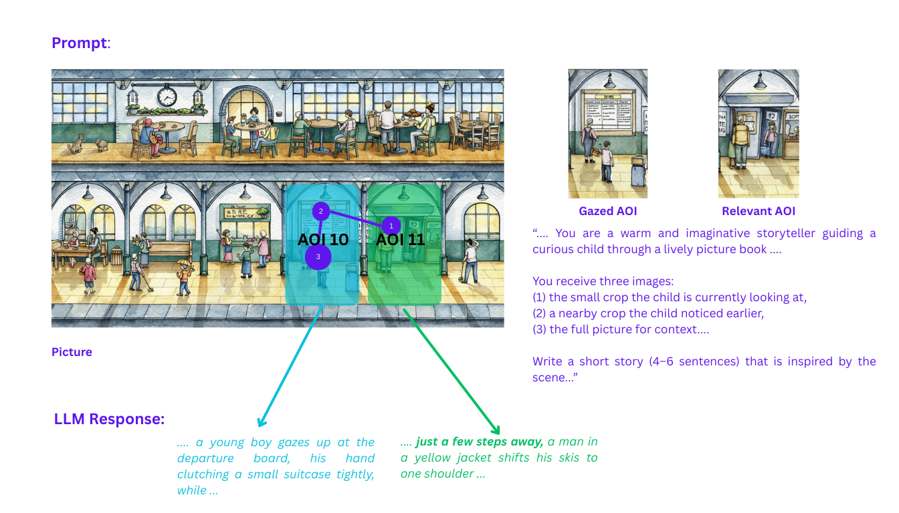
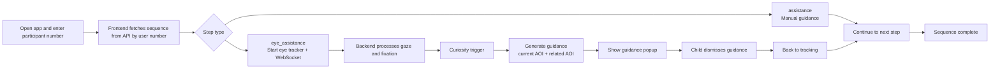

# Ollie

Ollie is a gaze-informed reading assistant for children’s picture exploration. Inspired by research on proactive AI storytelling, it observes a child’s visual attention and delivers short, curiosity-driven narrations that connect what the child is currently looking at with another meaningful part of the scene. Each guidance step links two areas of interest to encourage deeper exploration and narrative thinking. 



## API Keys Setup (LLM + TTS)

Ollie needs these backend keys:

- `CHATGPT_API_KEY` (LLM)
- `AZURE_SPEECH_KEY` (TTS)
- `AZURE_SPEECH_REGION` (for example `germanywestcentral`)

Set them as environment variables:

```powershell
$env:CHATGPT_API_KEY="your_chatgpt_key"
$env:AZURE_SPEECH_KEY="your_azure_speech_key"
$env:AZURE_SPEECH_REGION="germanywestcentral"
```

Then start backend in the same terminal.

## Quick Start

### 1) Start backend

```bash
cd backend
pip install -r requirements.txt
python start_dev.py
```

### 2) Start frontend

```bash
cd frontend
npm install
npm start
```

## Ollie Pipeline



Short explanation:

- Ollie loads a participant-specific sequence from the backend.
- Each step is either random `assistance` or gaze-based `eye_assistance`.
- In `eye_assistance`, only **curiosity** can trigger guidance.
- After guidance is dismissed, Ollie returns to tracking and continues the sequence.
